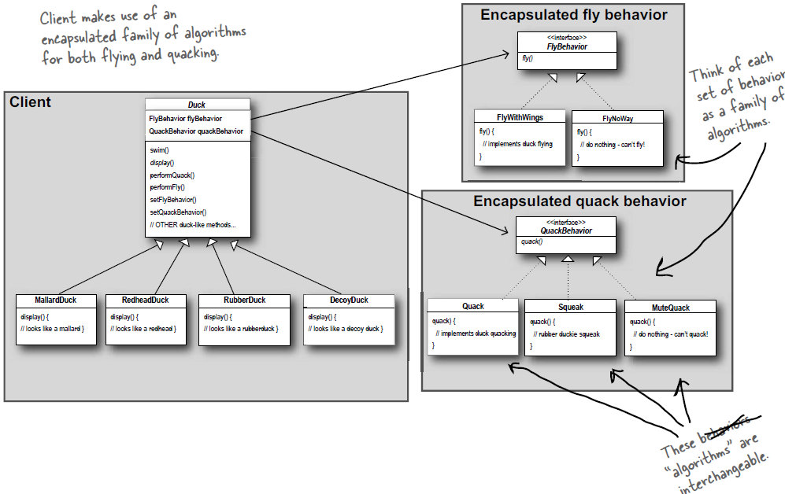

# Strategy

## Design Principles
1. Identify the aspects of your application that varies and separate them from what stays the same.
2. Program to an interface, not an implementation
3. favor composition over inheritance.

## Class Diagram

